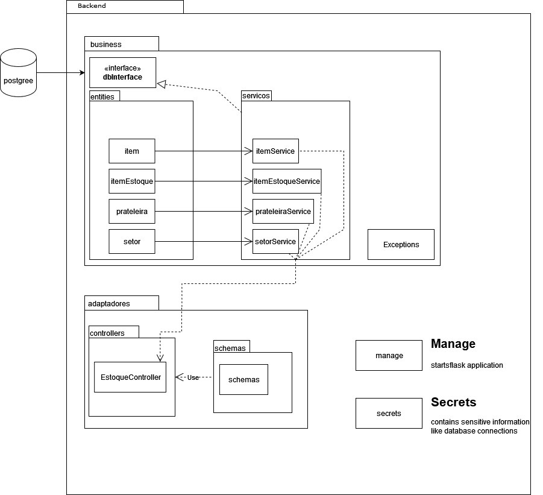
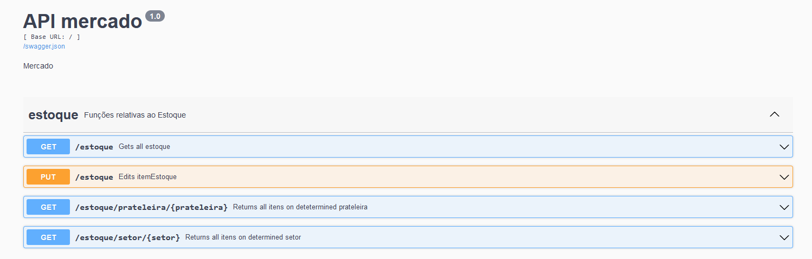

# Backend Controle de Estoque de um Mercado

#### Framework: Flask
#### Banco de dados: Postgreesql (uso de SQL Alchemy);
- #### Informações para conexão do banco devem ser alterados no 'secrets';

#### O arquivo principal para executar a API é manage.py;
#### Todos os requerimentos para a execução podem ser encontrados em requirements.txt
#### Exemplo para execução: `python3 manage.py flask`

# Diagrama da aplicação:

# Imagem da API swagger

#### Recomendado testar a API pelo próprio swagger.

## Features:

- Feature 1,2 e 3: Inclusão/Alteração/Remoção de novos itens no estoque
  - foram criados alguns itens estoque e eles podem ter quantidades adicionadas e removidas pelo PUT /estoque;
  - recebe id e quantidade como parâmetros no body para que seja feito a alteração;
  - falta: inclusão/remoção de itens para itens estoque
- Feature 4: Consulta de itens
  - foi criado um endpoint GET que retorna todos os itens em estoque `/estoque`; 
- Feature 5, 7: Consulta de itens por setor / consulta de prateleiras por setor
  - foi criado um endpoint GET `/estoque/setor/<setor_name>` que recebe uma string de nome de setor,
exemplo 'padaria' e retorna a lista de prateleiras naquele setor, e dentro de cada prateleira os seus itens;
- Feature 6: Consulta de itens por prateleira
- foi criado um endpoint GET `/estoque/prateleira/<prateleira_id>` que recebe um id de prateleira (existem de 1-7)
e retorna as informações da prateleira e todos os itens nela presentes;
