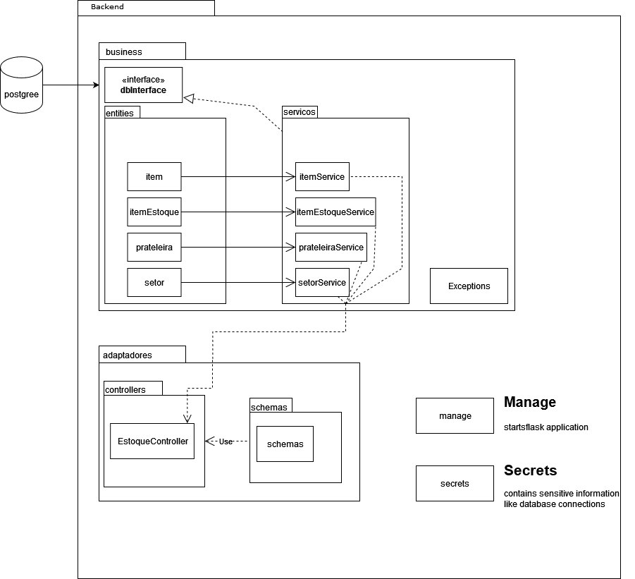

# Backend Controle de Estoque de um Mercado

#### Framework: Flask
#### Banco de dados: Postgreesql (uso de SQL Alchemy)
- #### Instância do banco de dados está rodando em Google Cloud (encerrarei ela dia 01/09/2022);
- #### Informações para conexão do banco devem ser alterados no 'secrets' (estão no email enviado);

#### O arquivo principal para executar a API é manage.py;
#### Todos os requerimentos para a execução podem ser encontrados em requirements.txt

# Diagrama da aplicação:

